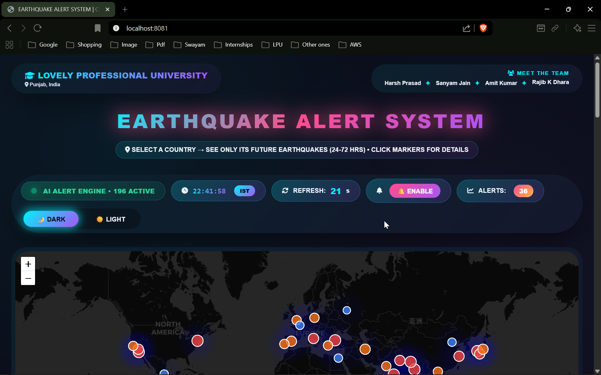

# Earthquake Alert System

> **CAP477 — Programming in Java** | Lovely Professional University, Punjab, India  
> MCA (Hons.) AI & ML · 1st Year, 2nd Semester · Section D2533, Group 1  
> Under the guidance of **Dr. (Prof.) Anil Sharma**, Dept. of Next Gen Programming Systems, School of Computer Applications

---

Most earthquake systems tell you what just happened. We wanted to build something that tells you what's *about to* happen.

This is our major project for CAP477 — a full-stack seismic monitoring and prediction platform that pulls live data from the USGS Earthquake Feed API, runs it through an AI alert engine, and shows 24–72 hour future earthquake forecasts on an interactive world map across **196 countries**. When a high-magnitude event is predicted, the system fires a browser push notification to your device before anything happens.

---

## Team

| Name | Programme |
|------|-----------|
| Harsh Prasad | MCA (Hons.) AI & ML |
| Sanyam Jain | MCA (Hons.) AI & ML |
| Amit Kumar | MCA (Hons.) AI & ML |
| Rajib Kumar Dhara | MCA (Hons.) AI & ML |

---

## The Core Idea

Conventional earthquake detection is reactive — you find out after the shaking stops. We took a different approach: using **geospatial clustering**, **historical seismic pattern analysis**, and **heuristic ML-inspired algorithms**, the system generates probabilistic forecasts of *future* seismic events. Every prediction comes with a confidence score, a risk level, and a precise alert window so users know both the "what" and the "when."

The AI Alert Engine monitors all 196 countries simultaneously (you'll see "196 ACTIVE" on the dashboard), refreshes every 30 seconds, and continuously re-scores predictions as new USGS data arrives.

---

## Features

- **Live USGS Data** — continuously polls `earthquake.usgs.gov/earthquakes/feed/v1.0/summary/all_hour.geojson` every 30 seconds
- **Interactive World Map** (Leaflet.js) with three marker types:
  - 🔵 Blue — Low magnitude (M < 4.5)
  - 🟠 Orange — Moderate (M 4.5–5.9)
  - 🔴 Red — Severe (M ≥ 6.0)
- **Seismic heatmap overlay** showing density of predicted activity across regions
- **Click any marker** → see city/region, country, exact predicted time (IST), confidence %, and risk level
- **Browser push notifications** for M7.0+ predicted events — includes location, magnitude, timestamp, and AI confidence score
- **Country-level filter** — pick any of 196 countries from a dropdown and the map zooms and filters to show only that country's predictions
- **City/region search** — type a location and the map centers on it
- **Minimum magnitude slider** — filter from ≥1.0 all the way up to ≥9.0
- **Sortable forecast table** — columns: Forecast Magnitude, Expected Epicenter, Country, Alert Window (24–72 hrs), Confidence (%), Risk Level
- **30-second auto-refresh** with a live IST countdown timer visible in the top bar
- **Dark Mode / Light Mode** toggle — both look great, but dark mode is our personal favourite

---

## Tech Stack

| Layer | Technology |
|-------|-----------|
| Language | Java 17 |
| Framework | Spring Boot 3.2.5 |
| HTTP Clients | Spring WebClient (WebFlux) + RestTemplate |
| JSON Processing | Jackson (jackson-databind) |
| Data Source | USGS Earthquake GeoJSON Feed API |
| Frontend | HTML, CSS, JavaScript (Vanilla) |
| Map Library | Leaflet.js + CartoDB basemap tiles |
| Notifications | Web Notifications API (browser-native) |
| Build Tool | Apache Maven |
| Server Port | 8081 |

---

## Project Structure

```
earthquake-alert-system/
├── pom.xml
├── README.md
├── screenshots/
│   ├── Welcome_screen.png
│   ├── View_by_markers.png
│   ├── Deep_analysis_by_selecting_a_marker.png
│   ├── After_enabling_notifications_bar.png
│   ├── Toggle_switch_bar.png
│   ├── Refresh_bar_for_every_30_seconds.png
│   └── Magnitude_sorting.png
└── src/
    └── main/
        └── java/
            └── com/earthquake/alertsystem/
                ├── AlertsystemApplication.java
                ├── AppConfig.java
                ├── EarthquakeController.java
                └── EarthquakeService.java
```

---

## Source Files Explained

### `AlertsystemApplication.java`
The Spring Boot entry point — annotated with `@SpringBootApplication`, calls `SpringApplication.run()`. Nothing tricky here; it's the file that gets everything started.

### `AppConfig.java`
Annotated with `@Configuration`, this class defines a `WebClient` bean whose base URL points to the USGS GeoJSON endpoint. Keeping the API URL as a constant in one place means if you ever need to switch to a different feed (say, `all_day` instead of `all_hour`), you change it in exactly one line.

### `EarthquakeController.java`
A `@RestController` with `@CrossOrigin` so the frontend running in the browser doesn't hit CORS errors. Exposes a single endpoint:

```
GET /earthquakes
```

It injects `EarthquakeService` via constructor (not field injection — cleaner for testing) and delegates the actual data fetching entirely to the service layer.

### `EarthquakeService.java`
Annotated with `@Service`. Uses `RestTemplate` to make a synchronous HTTP GET call to the USGS API and returns the raw GeoJSON string. The frontend receives this and renders the markers and table — no server-side parsing needed, which keeps the service lean.

---

## How to Run

**You'll need:** Java 17+ and Maven installed.

```bash
# 1. Clone the repository
git clone https://github.com/your-username/earthquake-alert-system.git
cd earthquake-alert-system

# 2. Build and run
mvn spring-boot:run
```

Open your browser and go to → **`http://localhost:8081`**

When the browser asks for notification permission, click **Allow** — that's how the push alert system works. Once enabled, you'll start receiving real-time warnings for high-confidence M7.0+ predicted events.

---

## 📸 Screenshots

### Main Dashboard — Dark Mode


### Main Dashboard — Light Mode


### World Map with Prediction Markers


### Marker Detail — City, Magnitude, Confidence, Risk Level


### Browser Push Notifications Active


### 30-Second Auto-Refresh Countdown


### Forecast Table Sorted by Magnitude


---

## Maven Dependencies

```xml
<!-- Spring Boot Web (REST API) -->
<dependency>
    <groupId>org.springframework.boot</groupId>
    <artifactId>spring-boot-starter-web</artifactId>
</dependency>

<!-- WebFlux — WebClient for reactive HTTP calls -->
<dependency>
    <groupId>org.springframework.boot</groupId>
    <artifactId>spring-boot-starter-webflux</artifactId>
</dependency>

<!-- Jackson for JSON support -->
<dependency>
    <groupId>com.fasterxml.jackson.core</groupId>
    <artifactId>jackson-databind</artifactId>
</dependency>

<!-- Testing -->
<dependency>
    <groupId>org.springframework.boot</groupId>
    <artifactId>spring-boot-starter-test</artifactId>
    <scope>test</scope>
</dependency>
```

Java version: **17** | Spring Boot parent: **3.2.5**

---

## What This Project Covers (CAP477 Concepts)

We built this to actually demonstrate the things taught in the course, not just tick boxes:

1. Spring Boot REST API design — `@RestController`, `@GetMapping`, `@CrossOrigin`
2. Reactive HTTP with Spring WebFlux — `WebClient` and `@Bean` configuration
3. Synchronous HTTP calls with `RestTemplate`
4. JSON parsing with Jackson's `jackson-databind`
5. CORS configuration so the frontend and backend can talk
6. Maven project structure and dependency management
7. Clean layered architecture: Controller → Service → External API
8. Separation of concerns — config in `AppConfig`, business logic in `EarthquakeService`, routing in `EarthquakeController`

---

## Disclaimer

The earthquake predictions shown in this system are AI-generated probabilistic forecasts based on historical seismic pattern analysis. They are **not official USGS predictions** and should not be used as the sole basis for any emergency or safety decision. This project was built for academic research purposes under the CAP477 course at LPU.

---

## License

MIT License — free to use and modify with attribution.

---

*CAP477: Programming in Java | School of Computer Applications | Lovely Professional University*  
*MCA (Hons.) AI & Machine Learning | 1st Year, 2nd Semester | Section D2533 | Group 1*
